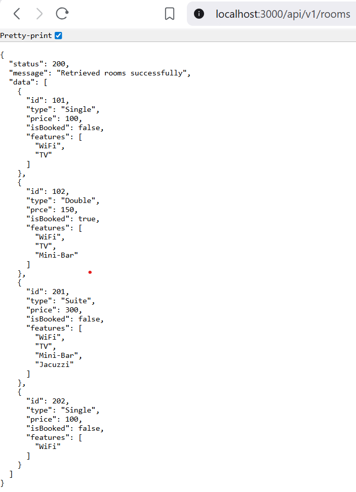

Markdown
# RESTful API Activity-John lloyd Tesio
## Best Practices Implementation
**1. Environment Variables.**
- Why did we put `BASE_URI` in `.env` instead of hardcoding it?
- Answer: We put BASE_URI in the .env file instead of hardcoding it to make the application more flexible and allow easy switching between development and production environments. It also keeps sensitive information, like API URLs or keys, secure and out of the codebase. Additionally, using .env makes the code cleaner, easier to maintain, and avoids repeating the same URL in multiple places.
**2. Resource Modeling:**
- Why did we use plural nouns (e.g., /`rooms`) for our routes?
- Answer: We use plural nouns for routes (like /rooms) because each route usually represents a collection of resources, not just a single item. This follows a common RESTful convention, making it clear that the route can handle multiple entries, such as getting all rooms or adding a new room. Using plural nouns also makes the API more consistent and intuitive for developers who work with it.
**3. Status Codes:**
- When do we use `201` Created vs `200 OK`?
- Why is it important to return `404`instead of just an empty array or a generic error?
- Answer: We use 201 Created when a new resource is successfully added to the server, such as creating a new dish, while 200 OK is used when a request succeeds but does not create a new resource, like fetching or updating data. Returning 404 Not Found is important because it clearly informs the client that the requested resource does not exist, unlike an empty array or a generic error, which can be confusing. Using the correct status codes makes the API more reliable, predictable, and easier to understand for developers.
**4. Testing:**
- 