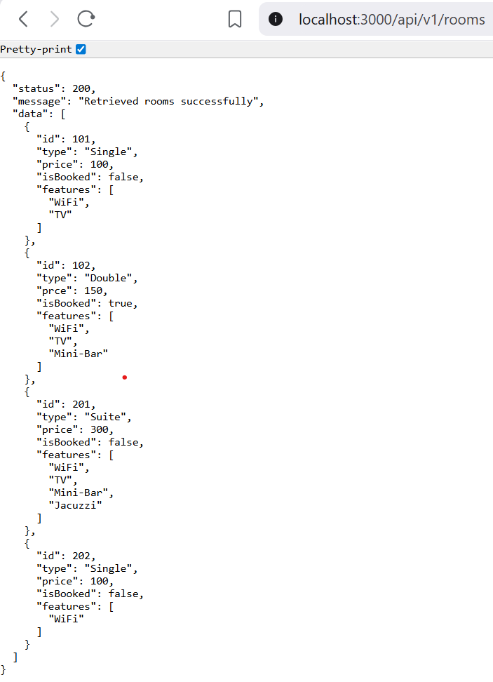

Markdown
# RESTful API Activity-John lloyd Tesio
## Best Practices Implementation
**1. Environment Variables.**
- Why did we put `BASE_URI` in `.env` instead of hardcoding it?
- Answer: We put BASE_URI in the .env file instead of hardcoding it to make the application more flexible and allow easy switching between development and production environments. It also keeps sensitive information, like API URLs or keys, secure and out of the codebase. Additionally, using .env makes the code cleaner, easier to maintain, and avoids repeating the same URL in multiple places.
**2. Resource Modeling:**
- Why did we use plural nouns (e.g., /`rooms`) for our routes?
- Answer: We use plural nouns for routes (like /rooms) because each route usually represents a collection of resources, not just a single item. This follows a common RESTful convention, making it clear that the route can handle multiple entries, such as getting all rooms or adding a new room. Using plural nouns also makes the API more consistent and intuitive for developers who work with it.
**3. Status Codes:**
- When do we use `201` Created vs `200 OK`?
- Why is it important to return `404`instead of just an empty array or a generic error?
- Answer: We use 201 Created when a new resource is successfully added to the server, such as creating a new dish, while 200 OK is used when a request succeeds but does not create a new resource, like fetching or updating data. Returning 404 Not Found is important because it clearly informs the client that the requested resource does not exist, unlike an empty array or a generic error, which can be confusing. Using the correct status codes makes the API more reliable, predictable, and easier to understand for developers.
**4. Testing:**
- 

### Why did I choose to Embed the [Review/Tag/Log]?
- Answer: I choose to embed the Room because these items are tightly connected to the main entity they describe, are usually accessed together, and do not need to exist independently. Embedding keeps the data simple, avoids unnecessary complexity, and makes retrieval more efficient.

### Why did I choose to Reference the [Chef/User/Guest]?
- Answer: I choose to reference the Guest because these entities can be associated with multiple records, and referencing prevents duplication of their information. This approach allows updates to be managed centrally, ensures consistency across the system, and supports scalability.

### Authentication vs Authorization:
- What is the difference between Authentication and Authorization in our
code?
- Answer: `Authentication` verifies who the user is, usually through login credentials like a username and password. `Authorization` determines what the user is allowed to do after they are authenticated, such as accessing certain pages or performing specific actions.

### Security (bcrypt):
- Why did we use bcryptjs instead of saving passwords as plain text in
MongoDB?
- Answer: We use `bcryptjs` instead of saving passwords as plain text in MongoDB to keep user passwords secure. bcryptjs hashes (encrypts) the password, so the actual password is not stored in the database. This helps protect users because even if the database is compromised, attackers cannot easily read or use the passwords. Storing passwords as plain text is unsafe since anyone who accesses the database could see all user passwords.

### JWT Structure:
- What does the protect middleware do when it receives a JWT from the
client?
- Answer: When the `protect middleware` receives a `JSON Web Token`, it verifies the token to make sure it is valid and was signed by the server. If the token is valid, the middleware decodes it to get the user’s information (such as the user ID), finds the user in the database, and allows the request to continue to the protected route. If the token is missing or invalid, the middleware blocks the request and returns an unauthorized access error.
